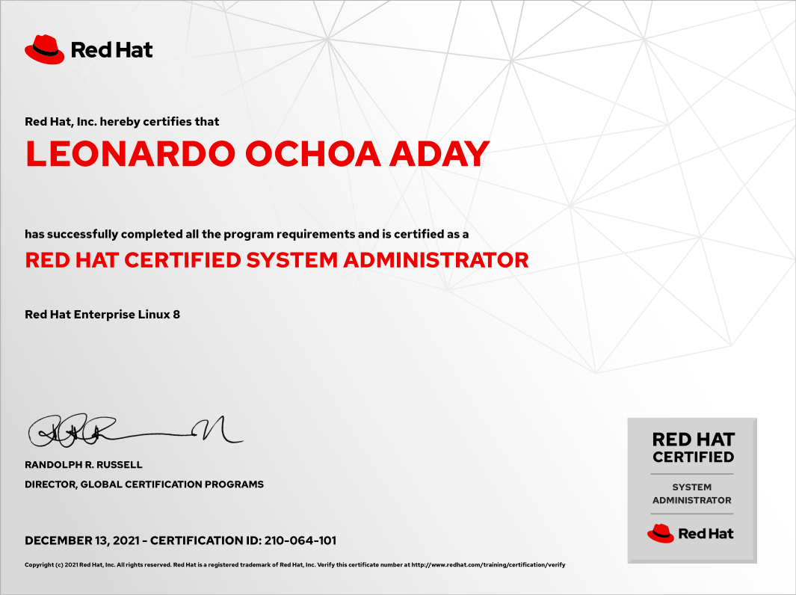

# Red Hat Certified System Administrator (RHCSA) exam

Online version of the objectives for the EX200 exam can be found in this [link](https://www.redhat.com/en/services/training/ex200-red-hat-certified-system-administrator-rhcsa-exam?section=Objectives).

## Study points for the (EX200) exam

RHCSA exam candidates should be able to accomplish the tasks below without assistance. These have been grouped into several categories.

### Understand and use essential tools

- Access a shell prompt and issue commands with correct syntax
- Use input-output redirection (>, >>, |, 2>, etc.)
- Use grep and regular expressions to analyze text
- Access remote systems using SSH
- Log in and switch users in multiuser targets
- Archive, compress, unpack, and uncompress files using tar, star, gzip, and bzip2
- Create and edit text files
- Create, delete, copy, and move files and directories
- Create hard and soft links
- List, set, and change standard ugo/rwx permissions
- Locate, read, and use system documentation including man, info, and files in /usr/share/doc

### Create simple shell scripts

- Conditionally execute code (use of: if, test, [], etc.)
- Use Looping constructs (for, etc.) to process file, command line input
- Process script inputs ($1, $2, etc.)
- Processing output of shell commands within a script
- Processing shell command exit codes

### Operate running systems

- Boot, reboot, and shut down a system normally
- Boot systems into different targets manually
- Interrupt the boot process in order to gain access to a system
- Identify CPU/memory intensive processes and kill processes
- Adjust process scheduling
- Manage tuning profiles
- Locate and interpret system log files and journals
- Preserve system journals
- Start, stop, and check the status of network services
- Securely transfer files between systems

### Configure local storage

- List, create, delete partitions on MBR and GPT disks
- Create and remove physical volumes (PVs)
- Assign physical volumes to volume groups (VGs)
- Create and delete logical volumes (LVs)
- Configure systems to mount file systems at boot by universally unique ID (UUID) or label
- Add new partitions and logical volumes, and swap to a system non-destructively

### Create and configure file systems

- Create, mount, unmount, and use vfat, ext4, and xfs file systems
- Mount and unmount network file systems using NFS
- Extend existing logical volumes
- Create and configure set-GID directories for collaboration
- Configure disk compression
- Manage layered storage
- Diagnose and correct file permission problems

### Deploy, configure, and maintain systems

- Schedule tasks using at and cron
- Start and stop services and configure services to start automatically at boot
- Configure systems to boot into a specific target automatically
- Configure time service clients
- Install and update software packages from Red Hat Network, a remote repository, or from the local file system
- Work with package module streams
- Modify the system bootloader

### Manage basic networking

- Configure IPv4 and IPv6 addresses
- Configure hostname resolution
- Configure network services to start automatically at boot
- Restrict network access using firewall-cmd/firewall

### Manage users and groups

- Create, delete, and modify local user accounts
- Change passwords and adjust password aging for local user accounts
- Create, delete, and modify local groups and group memberships
- Configure superuser access

### Manage security

- Configure firewall settings using firewall-cmd/firewalld
- Create and use file access control lists
- Configure key-based authentication for SSH
- Set enforcing and permissive modes for SELinux
- List and identify SELinux file and process context
- Restore default file contexts
- Use boolean settings to modify system SELinux settings
- Diagnose and address routine SELinux policy violations

### Manage containers

- Find and retrieve container images from a remote registry
- Inspect container images
- Perform container management using commands such as podman and skopeo
- Perform basic container management such as running, starting, stopping, and listing running containers
- Run a service inside a container
- Configure a container to start automatically as a systemd service
- Attach persistent storage to a container

> As with all Red Hat performance-based exams, configurations must persist after reboot without intervention.

## Certificate

A direct link to the Red Hat Certification Central webpage can be found [here](https://rhtapps.redhat.com/verify?certId=210-064-101).

- **Date:** December 13, 2021
- **Platform:** Red Hat Enterprise Linux 8
