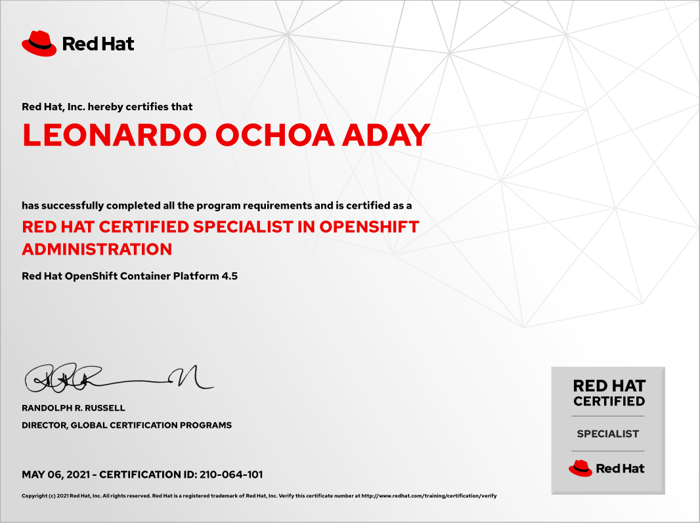

# Red Hat Certified Specialist in OpenShift Administration (RHCSOA) exam

Online version of the objectives for the EX280 exam can be found in this [link](https://www.redhat.com/en/services/training/ex280-red-hat-certified-specialist-in-openshift-administration-exam?section=Objectives).

## Study points for the (EX280) exam

To become a Red Hat Certified Specialist in OpenShift Administration, you should be able to perform these tasks.

### Manage OpenShift Container Platform

- Use the command-line interface to manage and configure an OpenShift cluster
- Use the web console to manage and configure an OpenShift cluster
- Create and delete projects
- Import, export, and configure Kubernetes resources
- Examine resources and cluster status
- View logs
- Monitor cluster events and alerts
- Troubleshoot common cluster events and alerts
- Use product documentation

### Manage users and policies

- Configure the HTPasswd identity provider for authentication
- Create and delete users
- Modify user passwords
- Modify user and group permissions
- Create and manage groups

### Control access to resources

- Define role-based access controls
- Apply permissions to users
- Create and apply secrets to manage sensitive information
- Create service accounts and apply permissions using security context constraints

### Configure networking components

- Troubleshoot software defined networking
- Create and edit external routes
- Control cluster network ingress
- Create a self-signed certificate
- Secure routes using TLS certificates

### Configure pod scheduling

- Limit resource usage
- Scale applications to meet increased demand
- Control pod placement across cluster nodes

### Configure cluster scaling

- Manually control the number of cluster workers
- Automatically scale the number of cluster workers

> As with all Red Hat performance-based exams, configurations must persist after reboot without intervention.

## Certificate

A direct link to the Red Hat Certification Central webpage can be found [here](https://rhtapps.redhat.com/verify?certId=210-064-101).

- **Date:** May 06, 2021
- **Platform:** Red Hat OpenShift Container Platform 4.5
