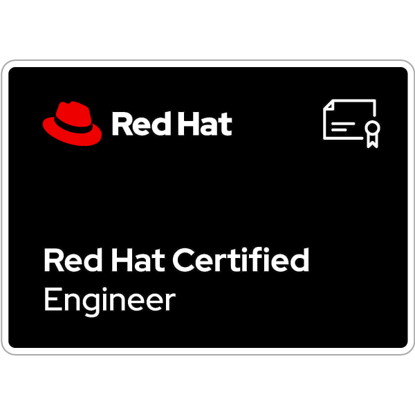

# Red Hat Certified Engineer (RHCE) exam

Online version of the objectives for the EX294 exam can be found in this [link](https://www.redhat.com/en/services/training/ex294-red-hat-certified-engineer-rhce-exam-red-hat-enterprise-linux-8?section=Objectives).

## Study points for the (EX294) exam

As an RHCE exam candidate, you should be able to handle all responsibilities expected of a Red Hat Certified System Administrator, including these tasks.

### Be able to perform all tasks expected of a Red Hat Certified System Administrator

- Understand and use essential tools
- Operate running systems
- Configure local storage
- Create and configure file systems
- Deploy, configure, and maintain systems
- Manage users and groups
- Manage security

### Understand core components of Ansible

- Inventories
- Modules
- Variables
- Facts
- Plays
- Playbooks
- Configuration files
- Use provided documentation to look up specific information about Ansible modules and commands

### Install and configure an Ansible control node

- Install required packages
- Create a static host inventory file
- Create a configuration file
- Create and use static inventories to define groups of hosts
- Manage parallelism

### Configure Ansible managed nodes

- Create and distribute SSH keys to managed nodes
- Configure privilege escalation on managed nodes
- Validate a working configuration using ad hoc Ansible commands

### Script administration tasks

- Create simple shell scripts
- Create simple shell scripts that run ad hoc Ansible commands

### Create Ansible plays and playbooks

- Know how to work with commonly used Ansible modules
- Use variables to retrieve the results of running a command
- Use conditionals to control play execution
- Configure error handling
- Create playbooks to configure systems to a specified state

### Use Ansible modules for system administration tasks that work with

- Software packages and repositories
- Services
- Firewall rules
- File systems
- Storage devices
- File content
- Archiving
- Scheduled tasks
- Security
- Users and groups

### Work with roles

- Create roles
- Download roles from an Ansible Galaxy and use them

### Use advanced Ansible features

- Create and use templates to create customized configuration files
- Use Ansible Vault in playbooks to protect sensitive data

> As with all Red Hat performance-based exams, configurations must persist after reboot without intervention.

## Certificate

A direct link to the Red Hat Certification Central webpage can be found [here](https://rhtapps.redhat.com/verify?certId=210-064-101).

- **Date:** Oct 06, 2022
- **Platforms:**
  - Red Hat Ansible Engine 2.9
  - Red Hat Enterprise Linux 8

A badge from Credly [here](https://www.credly.com/badges/7bd971f3-a179-48bf-9602-1aac26d070f0/public_url).

