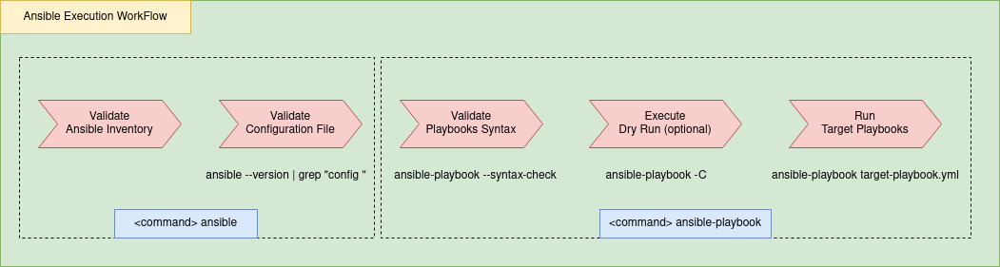

# Red Hat Certified Engineer (RHCE) exam

Online version of the objectives for the EX294 exam can be found in this [link](https://www.redhat.com/en/services/training/ex294-red-hat-certified-engineer-rhce-exam-red-hat-enterprise-linux-8?section=Objectives).

During the training preparations, I've identified two main workflows when working with Ansible. Detailed diagram for such workflows can be found attached below.

[//]: # (![Ansible Development Workflow]&#40;ansible-development-workflow.jpg&#41;)

[//]: # (<div style="text-align: center"> [WIP] Figure 1: Generic Ansible Workflow for developing Playbooks. </div>)


<div style="text-align: center"> Figure 2: Generic Ansible Workflow for executing Playbooks. </div>


## Study points for the (EX294) exam

As an RHCE exam candidate, you should be able to handle all responsibilities expected of a Red Hat Certified System Administrator, including these tasks.

### Be able to perform all tasks expected of a Red Hat Certified System Administrator

- Understand and use essential tools
- Operate running systems
- Configure local storage
- Create and configure file systems
- Deploy, configure, and maintain systems
- Manage users and groups
- Manage security

### Understand core components of Ansible

- Inventories
- Modules
- Variables
```shell
# variables ordered from highest to lowest precedence
# 1) variables defined on the command line
# 2) task variables
# 3) play variables in the playbook (vars and vars_files)
# 4) host facts, discovered at runtime (setup module)
# 5) host variables defined in files in a host_vars
# 6) host variables defined in the inventory
# 7) group variables defined in files in a group_vars
# 8) group variables defined in the inventory
```

- Facts
- Plays
- Playbooks
```shell
# 1) Syntax verification
ansible-playbook --syntax-check <playbook.yml>

# 2) Executing a Dry Run
ansible-playbook -C <playbook.yml>

# 3) Running Playbooks
ansible-playbook <playbook.yml>
```

- Configuration files
- Use provided documentation to look up specific information about Ansible modules and commands

### Install and configure an Ansible control node

- Install required packages
```shell
# 1) check if ansible is installed
rpm -q ansible

# 2) check available repos for ansible
dnf repolist all | grep ansible

# 3) enable repo for ansible
dnf config-manager --enable <ansible-2-for-rhel-8-x86_64-rpms>

# 4) install ansible
dnf install ansible
```

- Create a static host inventory file
```shell
# check hosts in the inventory
ansible <host/group> --list-hosts
```

- Create a configuration file
```shell
# 1) check config file used by Ansible
ansible --version
ansible <host/group> --list-hosts -v

# 2) Ansible config directory (Configuration File Precedence)
0. env | grep ANSIBLE_CONFIG  # overwrites all directories below
1. ./ansible.cfg              # (recommended) ansible's working directory 
2. ~/.ansible.cfg             # user's personal home directory
3. /etc/ansible/ansible.cfg   # system's global configuration directory 
```

> Note: If not of the above directory has a configuration *.cfg file, then Ansible will use its predefined defaults.

- Create and use static inventories to define groups of hosts
- Manage parallelism

### Configure Ansible managed nodes

- Create and distribute SSH keys to managed nodes
- Configure privilege escalation on managed nodes
```shell
grep "privilege_escalation" -A5 /etc/ansible/ansible.cfg

[privilege_escalation]
#become=True
#become_method=sudo
#become_user=root
#become_ask_pass=False
```

- Validate a working configuration using ad hoc Ansible commands
```shell
# 1) first check the hosts where to apply the ad-hoc command
ansible <host/group> --list-hosts -i <inventory>

# 2) then, execute the ad-hoc command to specified hosts
ansible <host/group> -m <module> -i <inventory>

# 3) some examples
ansible localhost -m setup | grep <param>
ansible <host/group> -m ping
```

### Script administration tasks

- Create simple shell scripts
- Create simple shell scripts that run ad hoc Ansible commands

### Create Ansible plays and playbooks

- Know how to work with commonly used Ansible modules
```shell
# 1) list all available modules on control node
ansible-doc -l

# 2) show documentation for module <name-here>
ansible-doc <name-here>

# 3) show example output for module fields
ansible-doc -s <name-here>  >>  <playbook.yml>
```

- Use variables to retrieve the results of running a command
- Use conditionals to control play execution
- Configure error handling
- Create playbooks to configure systems to a specified state

### Use Ansible modules for system administration tasks that work with

- Software packages and repositories
- Services
- Firewall rules
- File systems
- Storage devices
- File content
- Archiving
- Scheduled tasks
- Security
- Users and groups

### Work with roles

- Create roles
- Download roles from an Ansible Galaxy and use them

### Use advanced Ansible features

- Create and use templates to create customized configuration files
- Use Ansible Vault in playbooks to protect sensitive data
```shell
# 1) view the vault secret
ansible-vault view <secret.yml>

# 2) edit the vault secret
ansible-vault edit <secret.yml>

# NOTE: The edit subcommand always rewrites the file, so you should only use it when making changes.

# 3) encrypt an existing file
ansible-vault encrypt <secret.yml>

# 4) decrypt an existing file
ansible-vault decrypt <secret.yml> --output=<secret-decrypted.yml>
```

> Recommended Practices for Variable File Management is to store sensitive variables and all other variables in separate files. The files containing sensitive variables can then be protected with the ansible-vault command.

```shell
# 1) execute playbook with one secret
ansible-playbook --vault-id @prompt <playbook.yml>

# 2) execute playbook with multiple secrets
ansible-playbook --vault-id one@prompt --vault-id two@prompt <playbook.yml>
```

> As with all Red Hat performance-based exams, configurations must persist after reboot without intervention.
